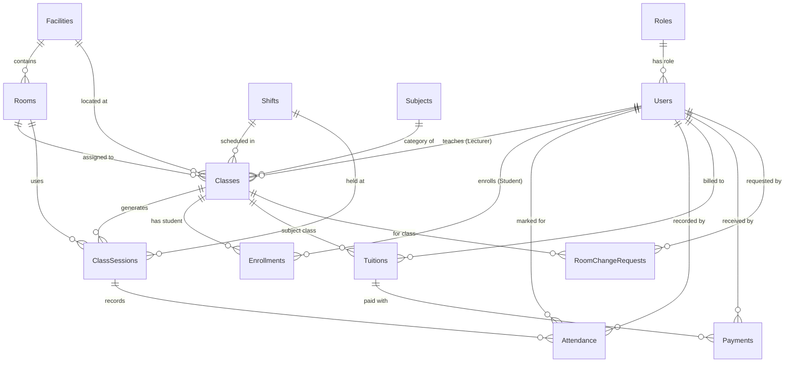

# BÁO CÁO ĐỒ ÁN CUỐI MÔN HỌC - PRN222
## HỆ THỐNG QUẢN LÝ TRUNG TÂM HỌC TẬP (EDUCENTER MANAGEMENT SYSTEM)

---

## 1. MÔ TẢ ĐẦY ĐỦ CÁC TÁC NHÂN HỆ THỐNG (SYSTEM ACTORS)

Hệ thống **EduCenter Management System** được thiết kế dựa trên mô hình phân quyền chặt chẽ cho **5 vai trò (roles)** chính:

1. **Quản trị viên (Admin)**: Người quản trị toàn quyền hệ thống, chịu trách nhiệm quản lý tài khoản người dùng, phân quyền, cấu hình thông số hệ thống và theo dõi các báo cáo tổng thể cấp cao.
2. **Quản lý cấp cao (Grand Manager)**: Người điều hành chuyên môn và đào tạo, chịu trách nhiệm quản lý nhân sự, quản lý môn học, mở lớp học, phân công giảng dạy và quản lý học phí toàn hệ thống.
3. **Quản lý cơ sở vật chất (Facility Manager)**: Người giám sát hạ tầng tại các cơ sở, chịu trách nhiệm theo dõi ma trận phòng học 6 phòng/cơ sở x 3 ca học, điều chỉnh trạng thái phòng (Mở hoạt động / Đóng bảo trì) và duyệt yêu cầu đổi phòng từ Giảng viên.
4. **Giảng viên (Lecturer)**: Người trực tiếp giảng dạy các lớp được phân công, thực hiện điểm danh học viên từng buổi học, xem thời khóa biểu cá nhân và gửi yêu cầu thay đổi phòng/ca học khi có nhu cầu.
5. **Học viên (Student)**: Người tham gia học tập, tra cứu thời khóa biểu cá nhân, theo dõi lịch sử đi học thực tế và kiểm tra học phí, hạn nộp.

---

## 2. MÔ TẢ CHỨC NĂNG NGHIỆP VỤ CỦA HỆ THỐNG

### 2.1. Quản trị viên (Admin)
- **Quản lý tài khoản toàn diện (User Management)**: Thêm mới, chỉnh sửa, xóa, khóa / kích hoạt tài khoản người dùng trên toàn hệ thống (Grand Manager, Facility Manager, Lecturer, Student) và phân quyền truy cập.
- **Bảng điều khiển & Thống kê tổng thể (Dashboard & Analytics)**:
  - Thống kê số lượng phòng học đang hoạt động (Open), phòng bảo trì (Closed) trên từng cơ sở (3 cơ sở).
  - Thống kê tổng số lượng học viên, giáo viên, lớp học và tỷ lệ lấp đầy phòng học theo ca (Timeline: Ca 1: 4h30–6h00, Ca 2: 6h00–7h30, Ca 3: 7h30–9h00).
  - Báo cáo doanh thu học phí toàn hệ thống theo môn học (Math, Literature, Physics, English, Chemistry) và theo 3 cơ sở.
- **Cấu hình hệ thống (System Settings)**: Cài đặt định mức học phí mặc định (200.000 VNĐ/buổi), cấu hình danh sách môn học và quản lý danh mục 3 cơ sở (mỗi cơ sở 6 phòng).

### 2.2. Quản lý cấp cao (Grand Manager)
- **Quản lý nhân sự & Học viên**: Phân quyền, xem danh sách, quản lý Facility Manager, Lecturer và danh sách Student.
- **Quản lý lớp học & Môn học**: Tạo mới lớp học, phân công giảng viên giảng dạy theo môn (Toán, Văn, Lý, Hóa, Anh), phân bổ ca học, phòng học, cơ sở và lịch học trong tuần.
- **Tính toán & Quản lý học phí (Tuition Management)**:
  - Tự động tổng hợp số buổi điểm danh có mặt (`Present`) của từng học viên.
  - Tự động tính học phí theo công thức:
    $$\text{Học phí} = (\text{Số buổi tham gia}) \times 200.000\text{ VNĐ}$$
  - Xuất báo cáo công nợ, trạng thái thanh toán (`Paid` / `Unpaid`), ghi nhận thu học phí và xuất biên lai thanh toán mẫu.

### 2.3. Quản lý cơ sở vật chất (Facility Manager)
- **Quản lý trạng thái phòng học (Room Status Matrix)**:
  - Giám sát trực quan trạng thái từng phòng học (6 phòng/cơ sở) theo từng ca học: Trống (`Available`) hoặc Đang sử dụng (`Occupied`).
  - Cập nhật điều kiện phòng: Mở cửa hoạt động (`Open`) hoặc Đóng cửa bảo trì (`Closed for Maintenance`).
- **Phân bổ phòng học & Phê duyệt yêu cầu**:
  - Gán số phòng học cụ thể cho Giảng viên theo môn học và khung giờ đăng ký.
  - Tiếp nhận, thẩm định, phê duyệt hoặc từ chối yêu cầu đổi phòng/đổi ca học từ Giảng viên kèm ghi chú.

### 2.4. Giảng viên (Lecturer)
- **Điểm danh học viên (Attendance Management)**:
  - Cập nhật trạng thái điểm danh học viên từng buổi học (`Present` / `ExcusedAbsent` / `UnexcusedAbsent`).
  - Chỉnh sửa và lưu vết lịch sử điểm danh theo từng ca học phụ trách.
- **Quản lý lịch dạy & Phòng học**:
  - Xem thời khóa biểu cá nhân theo ca và số phòng được chỉ định.
  - Gửi yêu cầu thay đổi phòng học hoặc đổi khung giờ trực tiếp tới Facility Manager trên hệ thống kèm lý do chi tiết.

### 2.5. Học viên (Student)
- **Tra cứu lịch học & Điểm danh**: Xem thời khóa biểu cá nhân (môn, phòng, cơ sở, giáo viên phụ trách) và theo dõi số ngày đã đi học thực tế.
- **Tra cứu học phí**: Xem chi tiết bảng tính học phí theo số buổi đã tham gia, hạn nộp và trạng thái nộp tiền.

---

## 3. THIẾT KẾ CƠ SỞ DỮ LIỆU & SƠ ĐỒ ERD

Hệ thống sử dụng **SQL Server** kết hợp với **Entity Framework Core**, bao gồm 14 bảng chuẩn hóa:

---

## 4. BẢNG PHÂN CÔNG NHIỆM VỤ THÀNH VIÊN NHÓM

| STT | Họ và Tên | Mã Sinh Viên | Vai Trò Trong Nhóm | Nhiệm Vụ Được Phân Công | Tỷ Lệ Đóng Góp |
|---|---|---|---|---|---|
| 1 | **Nguyễn Văn A** (Nhóm trưởng) | SE180001 | Leader & Backend Dev | Phân tích hệ thống, Thiết kế CSDL SQL Server, Xây dựng `EduCenterContext`, AuthService & Phân quyền Cookie Auth 5 vai trò. | 100% |
| 2 | **Trần Thị B** | SE180002 | Fullstack Dev | Xây dựng Module Admin Dashboard, Quản lý tài khoản Users, Cấu hình hệ thống & Room Matrix cho Facility Manager. | 100% |
| 3 | **Lê Văn C** | SE180003 | Fullstack Dev | Xây dựng Module Grand Manager (Lớp học, Phân công giảng dạy, Tự động tính học phí, Xuất biên lai) & Attendance cho Lecturer. | 100% |
| 4 | **Phạm Thị D** | SE180004 | Frontend & QA | Xây dựng UI Bootstrap 5, Custom Glassmorphism CSS, TagHelpers, PartialViews, Lịch học Student & Kiểm thử giao diện. | 100% |

---

## 5. DANH SÁCH TÀI KHOẢN DÙNG THỬ (DEMO ACCOUNTS)

Ứng dụng khởi tạo sẵn 5 tài khoản mẫu cho 5 vai trò (Mật khẩu mặc định: `123456`):

| Vai Trò | Email Đăng Nhập | Mật Khẩu | Mô Tả Chức Năng Thử Nghiệm |
|---|---|---|---|
| **Admin** | `admin@educenter.local` | `123456` | Xem Dashboard 3 cơ sở, tỷ lệ lấp đầy ca học, doanh thu môn/cơ sở, quản lý tài khoản & cài đặt hệ thống. |
| **Grand Manager** | `grandmanager@educenter.local` | `123456` | Tạo lớp học, phân công giảng viên, tự động tính học phí, ghi nhận thanh toán & xuất biên lai. |
| **Facility Manager** | `fm1@educenter.local` | `123456` | Xem ma trận phòng 6 phòng x 3 ca, chuyển trạng thái bảo trì, duyệt/từ chối đơn đổi phòng. |
| **Lecturer** | `lecturer.math@educenter.local` | `123456` | Xem thời khóa biểu giảng dạy, điểm danh học viên từng buổi học, nộp đơn đổi phòng. |
| **Student** | `student.a@educenter.local` | `123456` | Xem thời khóa biểu cá nhân, lịch sử đi học thực tế và tra cứu chi tiết học phí. |

---

## 6. KIỂM TRẢ RÀNG BUỘC & GHI LOG HỆ THỐNG

1. **Ràng buộc dữ liệu trong Code & CSDL**:
   - Tên đăng nhập Email duy nhất (`UNIQUE`), không trùng lặp.
   - Phòng học duy nhất theo cơ sở (`UNIQUE (FacilityId, RoomNumber)`).
   - Buổi học duy nhất theo lớp và ngày (`UNIQUE (ClassId, SessionDate)`).
   - Tự động tính học phí theo công thức `SessionsAttended * AmountPerSession` (Computed Column).
   - Model Validation kiểm tra định dạng email, mật khẩu băm SHA256 an toàn.
2. **Ghi Log hệ thống (Audit Logging)**:
   - Sử dụng `IAuditLogger` ghi vết toàn bộ thao tác nghiệp vụ quan trọng: Đăng nhập/đăng xuất, Đổi trạng thái tài khoản, Thu nộp học phí, Duyệt đơn đổi phòng, Điểm danh học viên. Log được ghi theo vết định dạng chuẩn hóa để phục vụ tra cứu kiểm toán.
